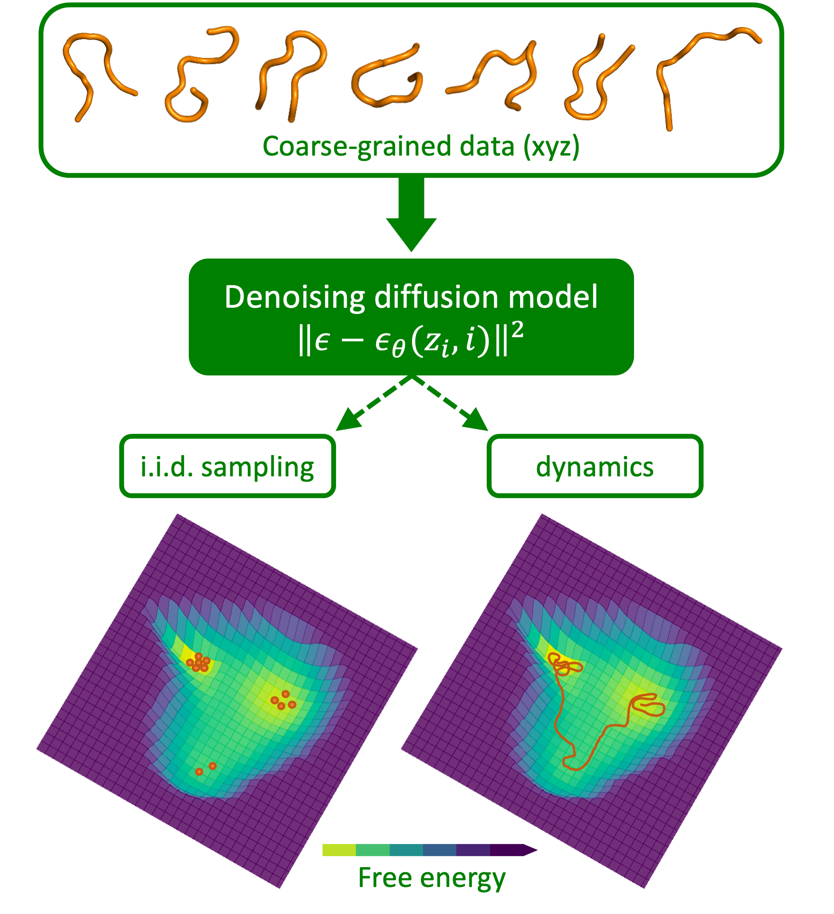
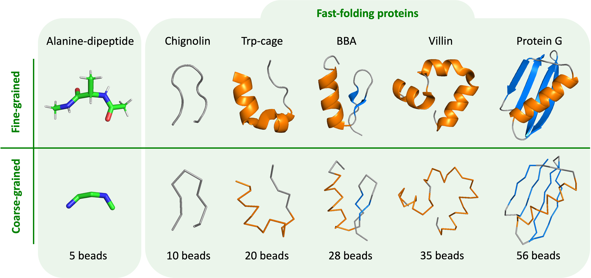

# Denoising force field
This Denoising Force Field (DFF) codebase provides a Pytorch framework for the method presented in [Two for one: Diffusion models and force fields for coarse-grained molecular dynamics](https://pubs.acs.org/doi/full/10.1021/acs.jctc.3c00702). This paper features a denoising diffusion model that is trained on coarse-grained protein dynamics data and can be used in two different settings:
1) Standard density modelling $\rightarrow$ i.i.d. sampling from the equilibrium distribution.
2) Extract the learned score $\rightarrow$ get the coarse-grained force field $\rightarrow$ use for Langevin dynamics simulations.

<br>

<p align="center">

</p>

***

## Requirements
Dependencies are listed in [coarse-graining-environment.yml](./coarse-graining-environment.yml) and can easily installed as an environment (named ```coarse-graining-environment```) through miniconda or anaconda by running
```
conda env create -f coarse-graining-environment.yml
```

***

## Sampling and evaluation
### Pretrained models 
Trained models per protein can be found in the [saved_models](./saved_models/) folder. 


<br> 

We include all test cases from the paper: 
1) Alanine dipeptide (4 folds)
2) Chignolin
3) Trp-cage
4) BBA
5) Villin
6) Protein G

<br>

For each protein, we provide a ```model-best.pt``` file with the checkpoint corresponding to the best validation loss as well as an ```args.pickle``` file containing the arguments used for that run.

### Sampling
Sampling for each protein can be done in either the i.i.d. setting or the dynamics setting using the [sample script](./sample.py). As an example, we show simple commands for obtaining chignolin samples in both settings. We refer to ```python sample.py --help``` for more sampling options and an explanation of all individual arguments. 

#### Drawing samples i.i.d.
Generating 1000 i.i.d. samples using a pretrained model:
```bash
python sample.py 
    --model_path saved_models/chignolin 
    --gen_mode iid 
    --num_samples_eval 1000 
    --batch_size_gen 256
```
#### Simulating using Langevin dynamics
Running 100 simulations of 10000 time steps, saving with an interval of 200 time steps. This will result in 5000 saved samples (= 100 x (10000 / 200)). Using the argument ```noise_level``` (here set to 20), the user can specify the diffusion model noise level used to extract force fields for Langevin dynamics.
```bash
python sample.py 
    --model_path saved_models/chignolin 
    --gen_mode langevin
    --noise_level 20
    --parallel_sim 100 
    --n_timesteps 10000
    --save_interval 200
```

The commands used to sample the Langevin dynamics as in the paper are provided in [./evaluate/sampling_commands.md](./evaluate/sampling_commands.md)

### Evaluation
In [evaluate](./evaluate/), we provide notebooks to exemplify how to evaluate generated samples with respect to the reference dataset. Since we assume that the reference data is not available, we provide reference distributions and TIC models in [saved_references](./saved_references/). We split the test cases into alanine dipeptide and the fast-folding proteins.

#### Alanine dipeptide
The [evaluate_ala2 notebook](./evaluate/evaluate_ala2.ipynb) can be used to evaluate alanine dipeptide in terms of dihedral free energy.

#### Fast-folding proteins
The [evaluate_fastfolders notebook](./evaluate/evaluate_fastfolders.ipynb) contains all evaluation for the fast-folding proteins:
* Pairwise distances
* Time-lagged independent component analysis (TICA)
* RMSD to native (folded) structure
* Contacts
* State transition probabilities (for dynamics only)

A more detailed description of each analysis is provided in the notebook.

***

## Training the diffusion model
> [!IMPORTANT]
> This codebase does not provide data. We refer to [this webpage](https://ftp.imp.fu-berlin.de/pub/cmb-data/) (file: 	```ala2_cg_2fs_Hmass_2_HBonds.npz```) from FU Berlin for freely available alanine dipeptide simulation data. 
> Fast folder data can be requested from D. E. Shaw Research as described in [the original paper](https://www.science.org/doi/full/10.1126/science.1208351).

This code base is mainly aimed at sampling and evaluation using pretrained models. However, the DFF model was trained from scratch using the [training script](./main_train.py). The underlying code for the DDPM and graph transformer can be found in the [models folder](./models/). For training options, please check:

```bash
python main_train.py --help
```

***

## External code-sources used to create this codebase
1. [DDPM base model](https://github.com/lucidrains/denoising-diffusion-pytorch) (PyTorch) by [Phil Wang (lucidrains)](https://github.com/lucidrains)
2. [Graph transformer](https://github.com/lucidrains/graph-transformer-pytorch) (PyTorch) by [Phil Wang (lucidrains)](https://github.com/lucidrains)
3. Several [plotting functions](./evaluate/evaluators_CGflowmatching.py) provided by the authors of [Flow-matching: Efficient coarse-graining of molecular dynamics without forces](https://pubs.acs.org/doi/full/10.1021/acs.jctc.3c00016).
4. Langevin dynamics from [CGnet](https://github.com/wutianyiRosun/CGNet) (PyTorch), by the authors of [Cgnet: A light-weight context guided network for semantic segmentation](https://ieeexplore.ieee.org/document/9292449).

***

## License
<span style="color: red;">**ADD LICENSE INFO!**</span>

***

## Citation
Please cite the following paper when using this code base:

MLA:
```
Arts, Marloes and Garcia Satorras, Victor, et al. "Two for one: Diffusion models and force fields for coarse-grained molecular dynamics." Journal of Chemical Theory and Computation 19.18 (2023): 6151-6159.
```

<br>

BibTeX:
```bibtex
@article{arts2023two,
  title={Two for one: Diffusion models and force fields for coarse-grained molecular dynamics},
  author={Arts, Marloes and Garcia Satorras, Victor and Huang, Chin-Wei and Zügner, Daniel and Federici, Marco and Clementi, Cecilia and No{\'e}, Frank and Pinsler, Robert and van den Berg, Rianne},
  journal={Journal of Chemical Theory and Computation},<br>
  volume={19},
  number={18},
  pages={6151--6159},
  year={2023},
  publisher={ACS Publications}
  }
```
